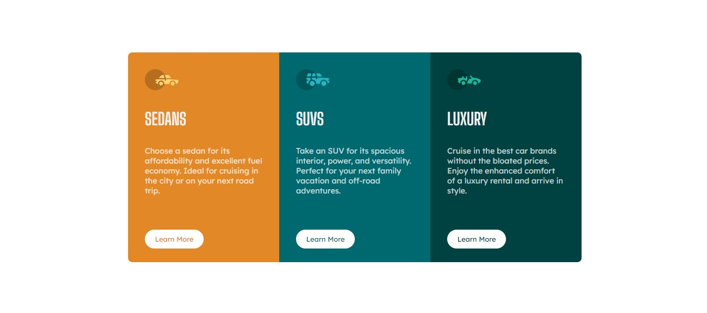
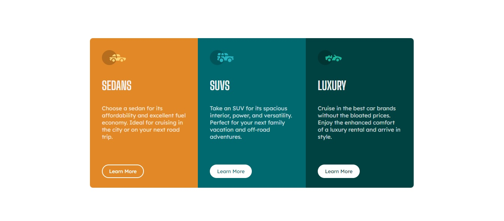
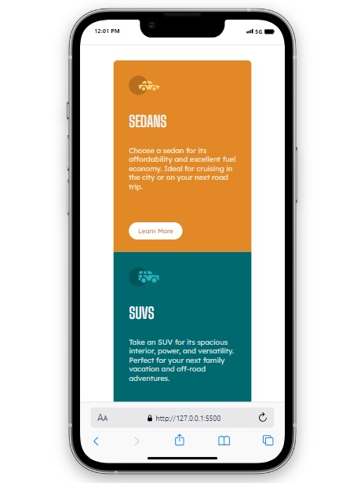

# 3-column preview card

## Table of contents

- [Overview](#overview)
  - [The challenge](#the-challenge)
  - [Screenshot](#screenshot)
  - [Built with](#built-with)
  - [What I learned](#what-i-learned)
  - [Links](#links)
- [Author](#author)


## Overview

This is a simple 3 card responsive layout for different vehicles and a button
that would link the user to another page for more information. The buttons 
have hover states and the layout will shift depending on screen size.


### The challenge

Users should be able to:

- View the optimal layout depending on their device's screen size
- See hover states for interactive elements


### Screenshot






### Built with

- HTML5
- CSS
- Flexbox


### What I learnt

This project was to cement my knowledge of responsive layouts and focus on media queries.
Mainly altering the flex direction when the screen size falls below 480px.


```css
@media screen and (max-width: 480px) {
    body {
        flex-direction: column;
    }
}
```

### Links

https://fonts.google.com/ - Google Fonts


## Author
- Lee Trewhitt
- Website - https://leetrw.github.io/


