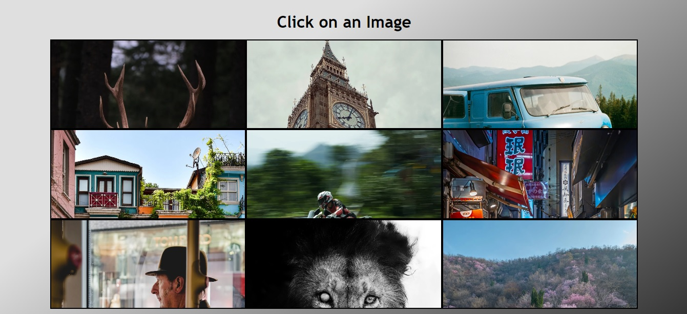
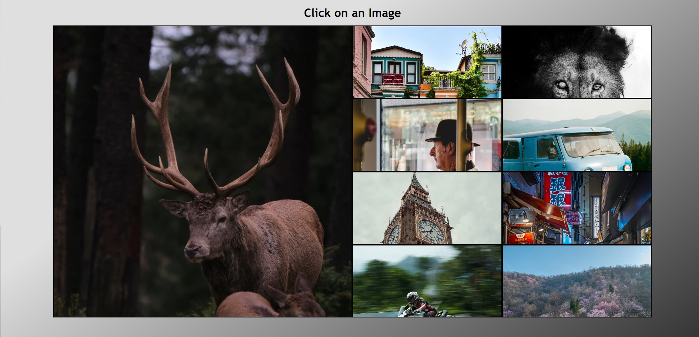
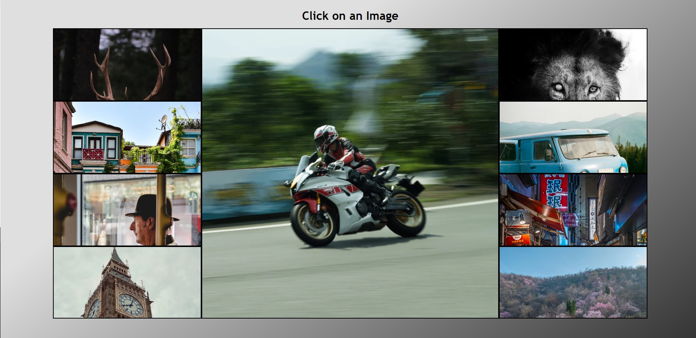

# 3 x 3 Flex Gallery

## Table of contents

- [Overview](#overview)
  - [The challenge](#the-challenge)
  - [Screenshot](#screenshot)
  - [Built with](#built-with)
  - [What I learned](#what-i-learned)
- [Author](#author)


## Overview

This is an example flex gallery with 9 images in a large container. The user must 
simply click on an image to enlarge it and the other images will skrink to fit the remaining
space.

### The challenge

Users should be able to: 

- See all images in the original layout of a 3 by 3 grid.
- Click on an image to enlarge it to take up 50% of the width and 100% of the height of the container.


### Screenshot






### Built with

- HTML5
- CSS
- Flexbox
- JavaScript


### What I learned

This project helped me practice using flex box and using its grow and shrink properties.
As well as JavaScript's array method forEach, to scan through a node list of divs in order
to add or remove the required classes. I also played with the css transition effect 
cubic-bezier to create a more unique transition effect. 

```css
transition: height 0.6s, width 1s cubic-bezier(1, 0.07, 0.77, 0.73);
```

```js
boxes.forEach(box => {
      if (box !== clickedBox) {
        box.classList.remove('large');
        box.classList.add('small');
      }
    });
```

## Author
- Lee Trewhitt
- Website - https://leetrw.github.io/


