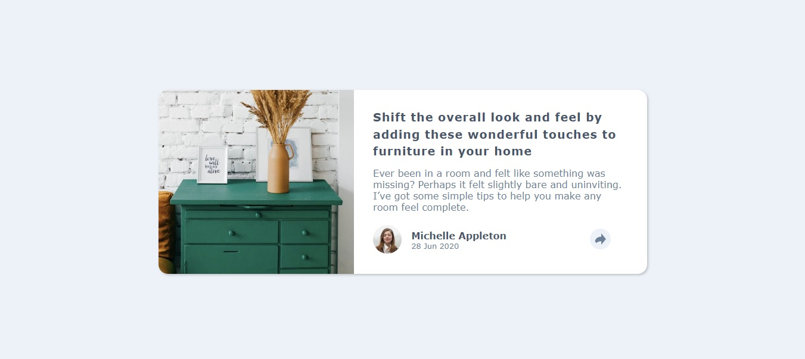
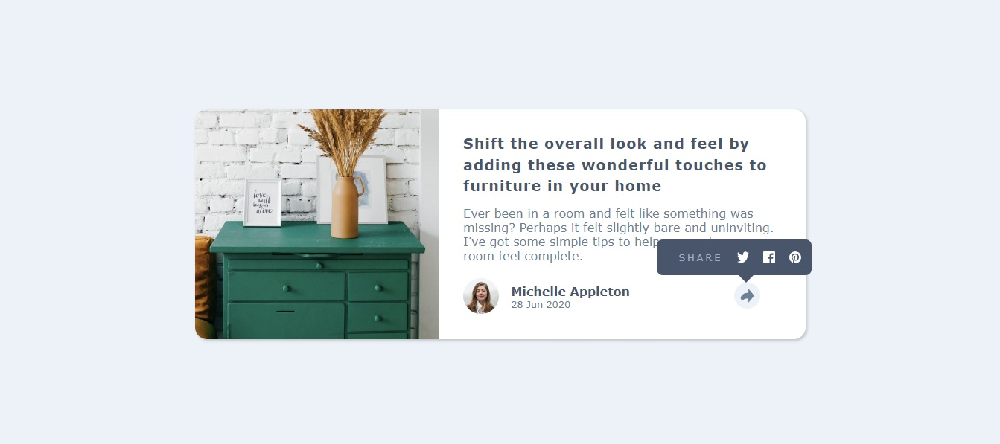
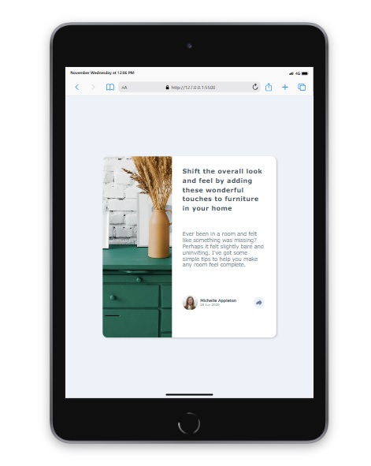
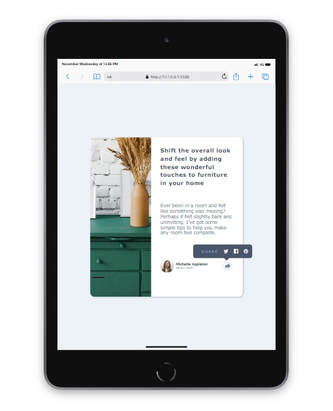
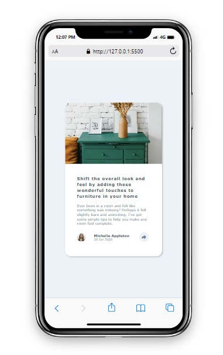
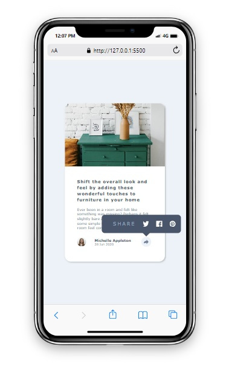

# Article Preview Component

## Table of contents

- [Overview](#overview)
  - [The challenge](#the-challenge)
  - [Screenshot](#screenshot)
  - [Built with](#built-with)
  - [What I learned](#what-i-learned)
- [Author](#author)


## Overview

This is an article preview component containing an interactive share button that 
would allow users to share the article on social media. Making sure the sharing 
component was always in the correct position regardless of screen size was particularly 
difficult and a great point of learning.  


### The challenge

Users should be able to: 

- View the optimal layout for the component depending on their device's screen size
- See the social media share links when they click the share icon


### Screenshot









### Built with

- Semantic HTML5 markup
- CSS / CSS variables
- Flexbox
- JavaScript


### What I learned

The main thing i learnt with this project was how to use JavaScript to 
toggle an elements visibility and control the elements positioning on 
the page.

```js
function show() {
  toggleCon.classList.toggle('active');

  // Set the position of '.toggle-con' based on the position of 'arrow'
  if (toggleCon.classList.contains('active')) {
    const arrowRect = arrow.getBoundingClientRect();
    toggleCon.style.top = arrowRect.top - toggleCon.offsetHeight - 10 + 'px';
    toggleCon.style.left = arrowRect.left + 'px';
  }
}
```

## Author
- Lee Trewhitt
- Website - https://leetrw.github.io/


