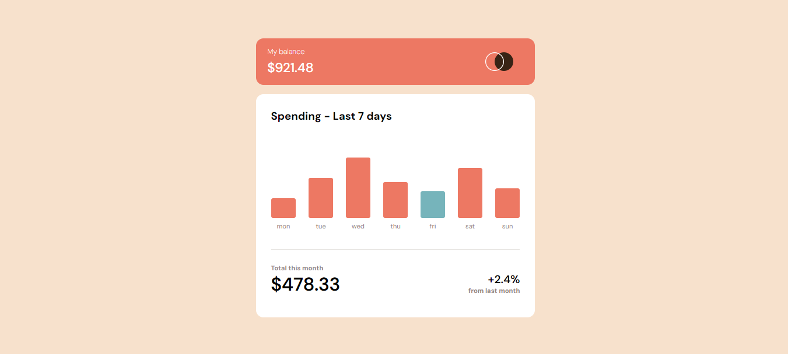
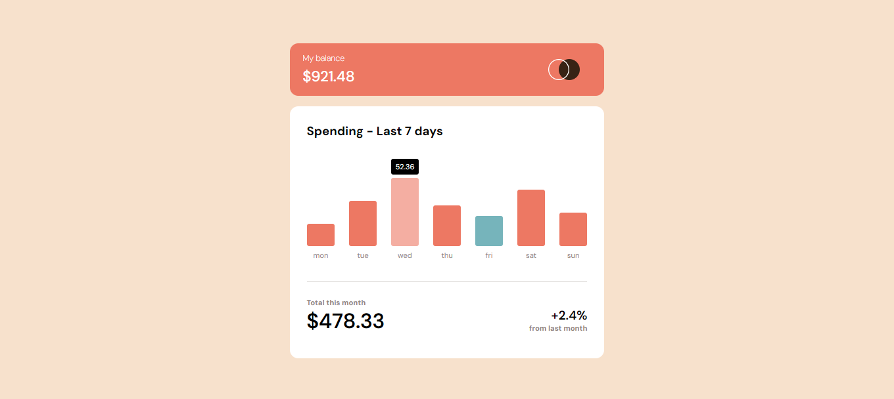
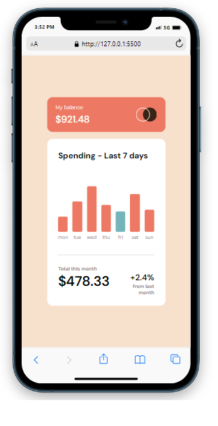

# Expenses Chart Component

## Table of contents

- [Overview](#overview)
  - [The challenge](#the-challenge)
  - [Screenshot](#screenshot)
  - [Built with](#built-with)
  - [What I learned](#what-i-learned)
  - [Links](#links)
- [Author](#author)


## Overview

This is an expenses chart component that uses a JSON file to dynamically set the 
height of the bars in the graph and display the spending for each day when
the day is hovered over. The current day will also be highlighted in blue on the 
chart. As this is a single component the figures outside the chart are static and
do not change regardless of the costs within the JSON file. 


### The challenge

Users should be able to:

- View the bar chart and hover over the individual bars to see the correct amounts for each day
- See the current day’s bar highlighted in a different colour to the other bars
- View the optimal layout for the content depending on their device’s screen size
- See hover states for all interactive elements on the page
- Dynamically size the bars on the chart and change the daily spend with the JSON file

### Screenshot






### Built with

- HTML5
- CSS
- Flexbox
- JavaScript


### What I learnt

I used this project to practice using a JSON data file with JavaScript to 
change the height of the bars in the chart. As well as using the data to 
populate the daily spend that is visible when hovering over an element. I 
used .map to make an array of the JSON data type 'amount', then I used a for
loop to cycle through the elements. In this cycle I manipulated the height
styling and the inner HTML of two elements with the json data array. 

```JSON
[
  {
    "day": "mon",
    "amount": 17.45
  }
]
```
```js
 const amount = data.map(item => item.amount);

        if (amount) {
            for (let i = 0; i < days.length; i++) {
                days[i].style.height = amount[i] * 2 + 'px';
                daySpend[i].innerHTML = amount[i]; 
        }
        } else {
            console.log('error');
        }
```


### Links

https://fonts.google.com/ - Google Fonts


## Author
- Lee Trewhitt
- Website - https://leetrw.github.io/


