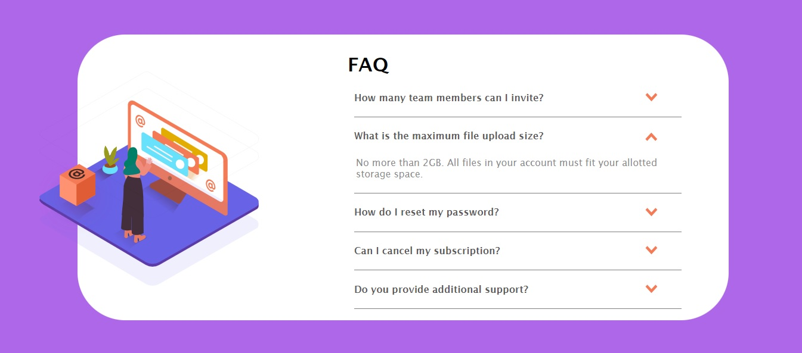
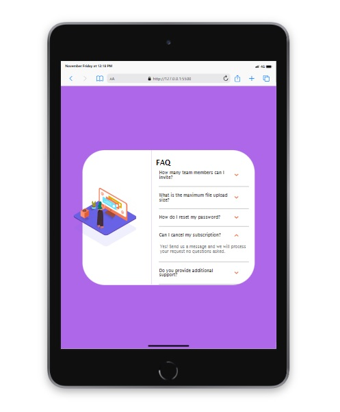
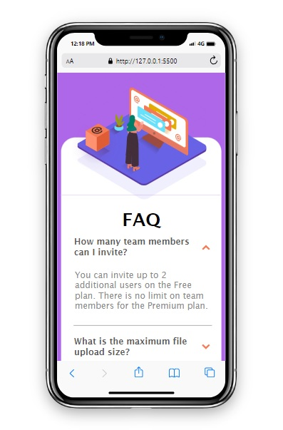

# FAQ accordion card

## Table of contents

- [Overview](#overview)
  - [The challenge](#the-challenge)
  - [Screenshot](#screenshot)
  - [Built with](#built-with)
  - [What I learned](#what-i-learned)
- [Author](#author)


## Overview

This is an example of a simple accordion style FAQ card and it was built using 
CSS, HTML and some JavaScript. It was built purely for practice and strengthened
my knowledge of adding and removing classes with JavaScript in order to hide,
show and manipulate HTML elements.  


### The challenge

Users should be able to: 

- View the optimal layout for the component depending on their device's screen size
- Click the arrow for each FAQ and see the response.
- If an FAQ answer is open and the user selects another the previous should hide itself.


### Screenshot







### Built with

- HTML5
- CSS
- Flexbox
- JavaScript


### What I learned

In this projct I practiced using JavaScript to add and remove classes on the different
elements when the arrow icons where clicked. The adding of classes forces a height change
on the answer element and a rotation change on the arrows. The removal of the class
reverts these changes. The function also checks the index of the active answer
from an array and will remove the class from an element if it is not the current active
element.

```js
function openAnswer(index) {
    if (activeAnswer === answers[index]) {
        answers[index].classList.remove('active');
        arrows[index].classList.remove('active');
        activeAnswer = null;
        activeArrow = null;
    } else {
        if (activeAnswer !== null) {
            activeAnswer.classList.remove('active');
            activeArrow.classList.remove('active');
        }

        answers[index].classList.add('active');
        activeAnswer = answers[index];
        arrows[index].classList.add('active');
        activeArrow = arrows[index];
    }
}

arrows.forEach((arrow, index) => {
    arrow.addEventListener('click',() => {
        openAnswer(index);
    });
});
```

## Author
- Lee Trewhitt
- Website - https://leetrw.github.io/


