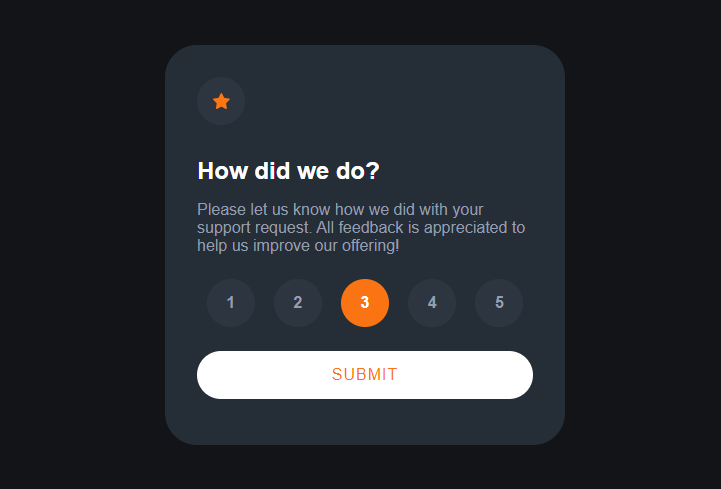

# Interactive rating component 

## Table of contents

- [Overview](#overview)
  - [The challenge](#the-challenge)
  - [Screenshot](#screenshot)
  - [Built with](#built-with)
  - [What I learned](#what-i-learned)
  - [Links](#links)
- [Author](#author)


## Overview

This is an interative rating component where a user can select a rating between 1 and 5
for the service they recieved for a ficticious support resquest. After the user has selected 
their rating a thank you page will be displayed. I made this in order to practice using 
HTML data attributes with JavaScript. 


### The challenge

Users should be able to:

- View the optimal layout for the app depending on their device's screen size
- See hover states for all interactive elements on the page
- Select and submit a number rating
- See the "Thank you" card state after submitting a rating


### Screenshot





### Built with

- Semantic HTML5 markup
- CSS / CSS variables
- Flexbox


### What I learned

I used this project to practice using HTML data attributes with JavaScript. I learnt
how to select specific HTML elements through this and use JavaScript to manipulate 
other elements on the page. In this project the selected element when pressing the submit
button will display a message affirming the choice made by the user. I also used the
project to practice using CSS variables, in this case for the colors.

```html
<div class="num" data-rating="1">1</div>
```
```js
selectedRating = parseInt(option.getAttribute('data-rating'));
```
```css
:root {
    /*Primary*/
    --Orange: hsl(25, 97%, 53%);
    /*Secondary*/
    --VeryDarkBlue: hsl(216, 12%, 8%);
}
body {
    background-color: var(--VeryDarkBlue);
}
```

### Links

https://fonts.google.com/ - Google Fonts


## Author
- Lee Trewhitt
- Website - https://leetrw.github.io/


