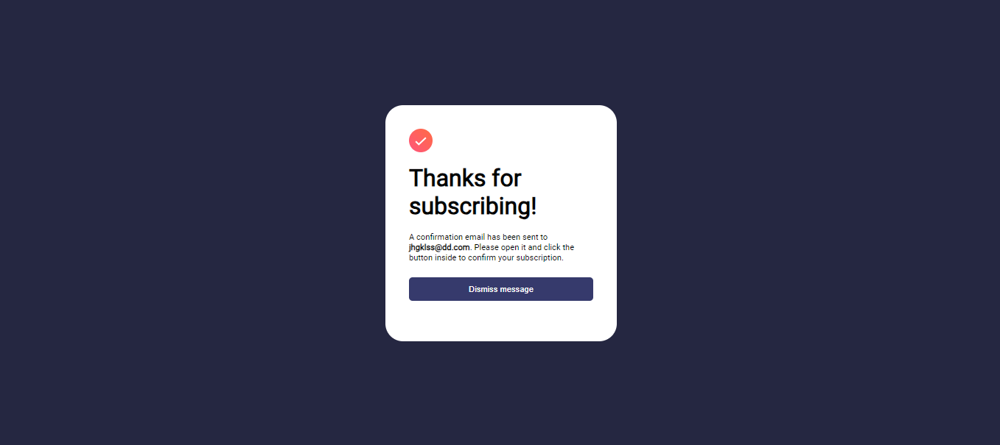
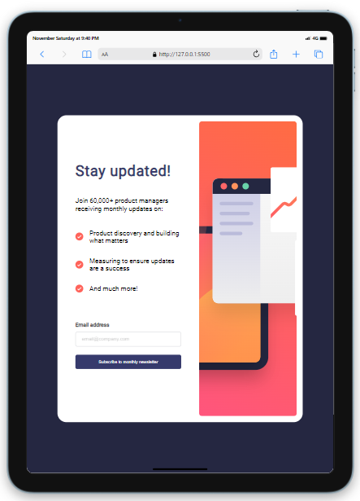
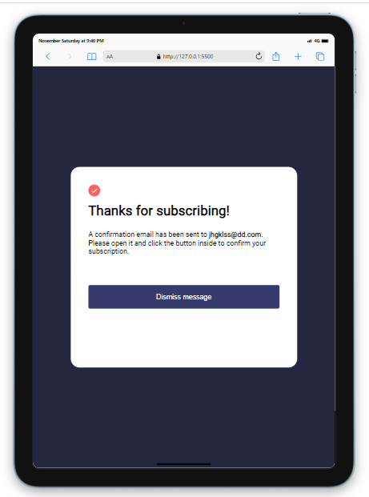
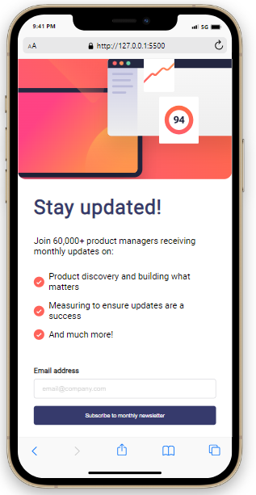
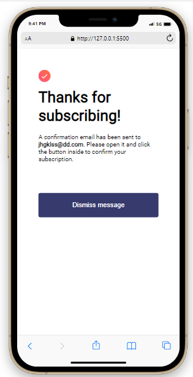

# Newsletter Sign Up Form

## Table of contents

- [Overview](#overview)
  - [The challenge](#the-challenge)
  - [Screenshot](#screenshot)
  - [Built with](#built-with)
  - [What I learned](#what-i-learned)
- [Author](#author)


## Overview

This is a practice newsletter sign up form where a user can enter their email to receive monthly 
updates from the company. The form will check whether the email entered is a valid email and
if the check is successful a thank you page will be displayed along with a message for the user.
The email verification and the message both rely on JavaScript functions to operate. The first
function will check the validity of the email by comparing the input to an email pattern and the
second will take the enetered email and add it into the message displayed to the user.  


### The challenge

Users should be able to:

- Add their email and submit the form
- See a success message with their email after successfully submitting the form
- See form validation messages if:
  - The field is left empty
  - The email address is not formatted correctly
- View the optimal layout for the interface depending on their device's screen size
- See hover and focus states for all interactive elements on the page


### Screenshot









### Built with

- HTML5
- CSS
- Flexbox
- JavaScript


### What I learned

The project allowed me to practice using a form validation function joined with 
CSS and HTML manipulation. The email validation checks the users input with
a simple email pattern to verify that it is formatted correctly. The function 
also changes the display styling of HTML elements to change the page from the 
sign up form to a thank you page. Finally I practiced changing the innerHTML 
content of the thank you page in order to show a message alerting the user that
the email they had just enetered will have been sent an email in order to verify it. 


```js
if (!emailPattern.test(email.value)){
        email.classList.add('error');
        errorMessage.innerHTML = 'Valid Email Required';
    } else {
        email.classList.remove('error');
        errorMessage.innerHTML = '';
        container.style.display = 'none';
        thanks.style.display = 'flex';
        userEmail.innerHTML = email.value;
    }
```

## Author
- Lee Trewhitt
- Website - https://leetrw.github.io/


