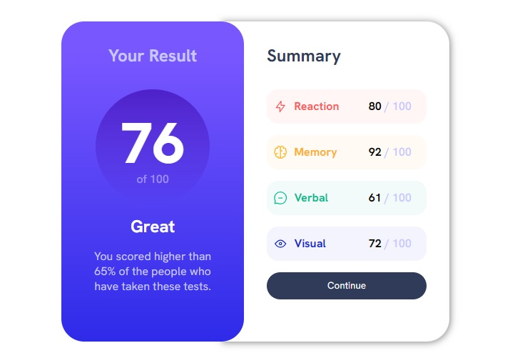
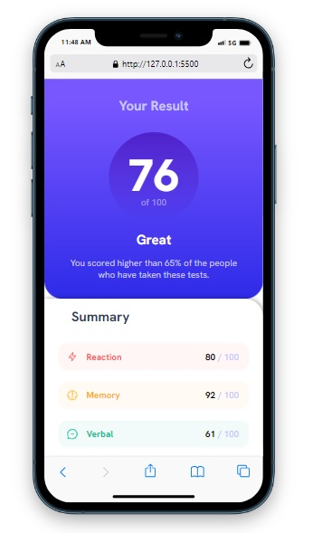

# Interactive rating component 

## Table of contents

- [Overview](#overview)
  - [The challenge](#the-challenge)
  - [Screenshot](#screenshot)
  - [Built with](#built-with)
  - [What I learned](#what-i-learned)
  - [Links](#links)
- [Author](#author)


## Overview

This is a results summary card that obtains data from a JSON file and displays the given
 scores out of 100. I made this in order to practice using JavaScript to fetch JSON data 
 and populate HTML elements. 


### The challenge

Users should be able to:

- View the optimal layout for the interface depending on their device's screen size
- See hover and focus states for all interactive elements on the page
- Use the local JSON data to dynamically populate the content


### Screenshot





### Built with

- HTML5
- CSS / CSS variables
- Flexbox
- JavaScript


### What I learnt

I used this project to practice using a JSON data file with JavaScript to 
populate the scores on the results card. I learnt how to fetch JSON data and 
use '.find' to extract the desired information. I also used the project to
practice using CSS variables, in this case for the colors.

```JSON
[{
    "category": "Reaction",
    "score": 80,
  }]
```
```js
var reactionData = data.find(item => item.category === "Reaction");

if (reactionData) {
            // Populate the HTML element with the score from the JSON data
            reactionScore.textContent = reactionData.score;
            reactionTitle.textContent = reactionData.category;
        } else {
            // Handle the cases where data is not found
            reactionScore.textContent = "N/A";
        }
```
```css
:root {
--Lightred: hsl(0, 100%, 67%);
}
 .right .reaction {
    color: var(--Lightred);
 }
```

### Links

https://fonts.google.com/ - Google Fonts


## Author
- Lee Trewhitt
- Website - https://leetrw.github.io/


